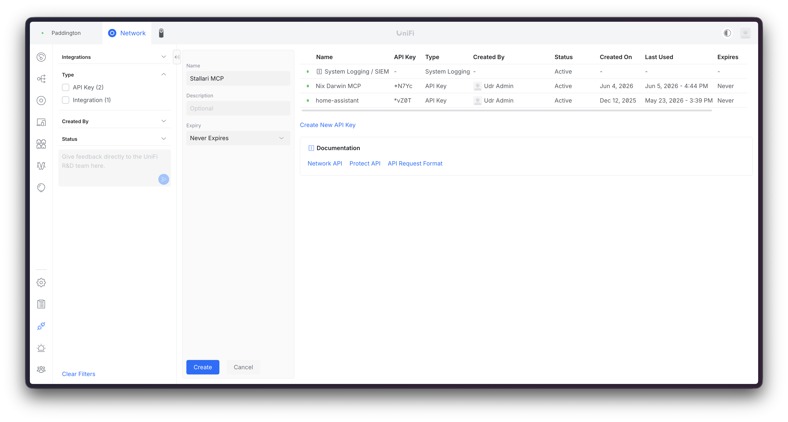
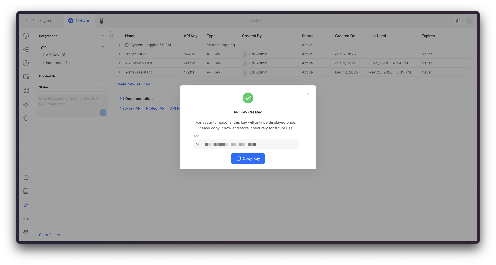
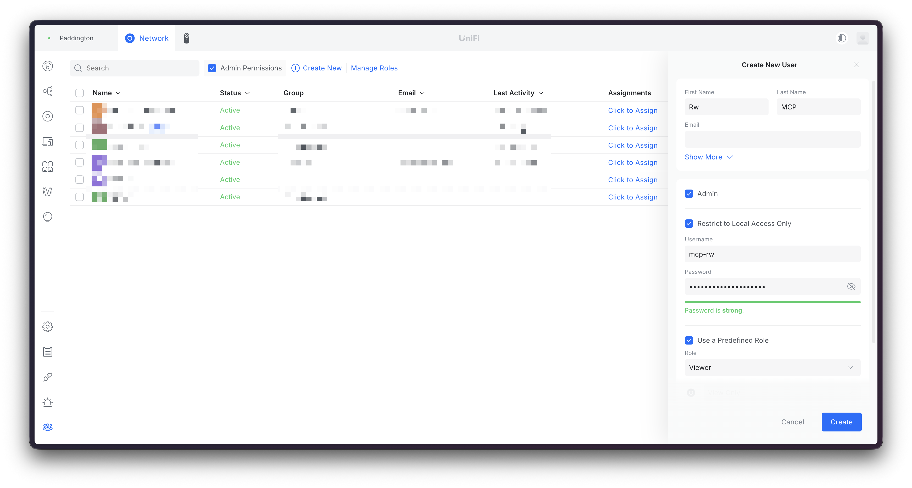
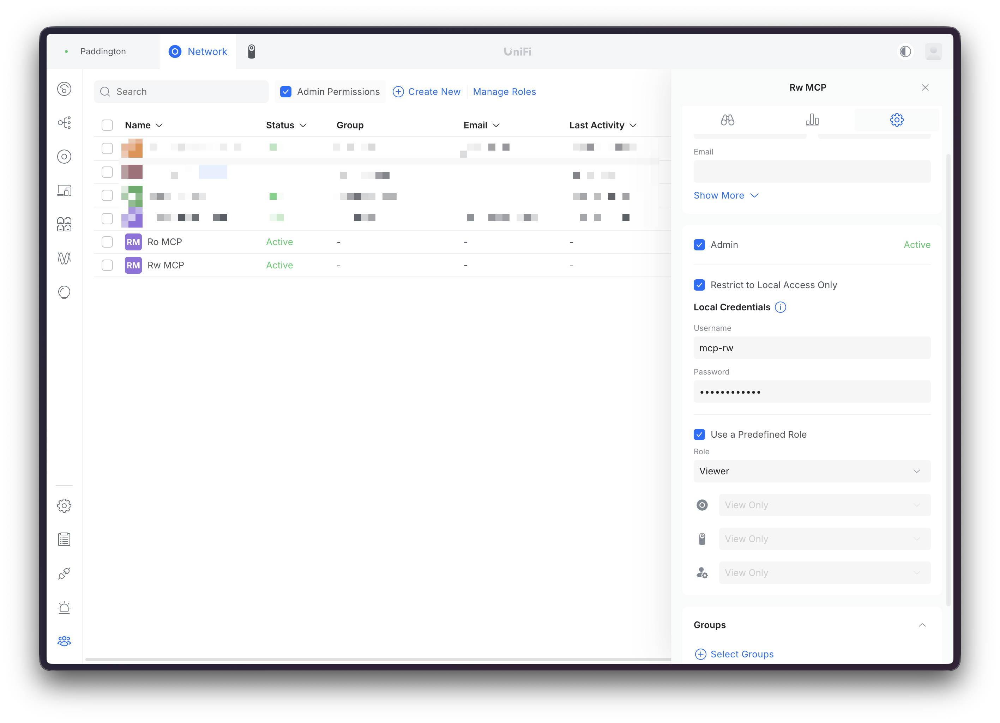

# ubiquiti-unifi-blade-mcp

An MCP server that gives AI agents structured access to Ubiquiti UniFi network controllers. Built for the [Model Context Protocol](https://modelcontextprotocol.io) with security visibility and token efficiency as first-class design goals.

## Why this exists

UniFi controllers expose a rich but undocumented REST API behind cookie-based auth with CSRF tokens and optional 2FA. The [aiounifi](https://github.com/Kane610/aiounifi) library (MIT, powers the Home Assistant integration) handles the protocol complexity — UniFi OS vs classic controller detection, TOTP 2FA, websocket events. This MCP wraps it with the guardrails that automated agents need:

- **Security-first tool set** — 18 tools focused on what network security agents actually need: device health, client visibility, firewall state, traffic rules, DPI restrictions, port forwards. Not 161 tools for every possible configuration change.
- **Token-efficient output** — compact pipe-delimited format. A 30-device network in ~50 tokens per device. Client listings with signal strength, experience score, and blocked status at a glance.
- **Write-gated mutations** — client blocking, WLAN toggling, device restart, and traffic route changes require explicit opt-in via `UNIFI_WRITE_ENABLED=true`. Destructive operations (block, restart) additionally require per-call `confirm=true`.
- **Multi-controller** — manage home and office networks from a single MCP instance. Each controller authenticates independently with separate sessions.

## How this differs from other UniFi MCPs

| | ubiquiti-unifi-blade-mcp | sirkirby/unifi-mcp | enuno/unifi-mcp-server |
|---|---|---|---|
| **Focus** | Monitoring + security + Integration-API resource mgmt (28 tools) | Full management (161 tools) | Full management (74 tools) |
| **Design for** | LLM agents (token-efficient) | Claude Code (lazy loading) | General MCP clients |
| **Multi-controller** | Native (env var config) | Single controller | Multi-mode (local/cloud) |
| **Write safety** | Dual-gated (env + confirm) | Preview-then-confirm | Permission model |
| **2FA support** | TOTP via aiounifi | TOTP support | API key option |
| **Output** | Pipe-delimited, compact | Full JSON | Full JSON |
| **Marketplace** | Sidereal certified | Claude Code plugin | Standalone |

Use this blade-MCP for agent-driven monitoring and security. Use sirkirby/unifi-mcp (available as a community listing in the Sidereal marketplace) when you need full network configuration management.

## Quick start

```bash
# Install
uv pip install -e .

# Configure (monitoring tools — username/password)
export UNIFI_HOST="192.168.1.1"
export UNIFI_USERNAME="admin"
export UNIFI_PASSWORD="your-password"
export UNIFI_VERIFY_SSL="false"  # Common for self-signed certs

# Configure (network/VLAN tools — Integration API key)
# Generate in UniFi Network → Settings → Control Plane → Integrations
export UNIFI_API_KEY="your-x-api-key"

# Run
ubiquiti-unifi-blade-mcp
```

## Authentication: two modes

| Mode | Env | Drives | Endpoint | Support status |
|------|-----|--------|----------|----------------|
| **API key** | `UNIFI_API_KEY` (`X-API-KEY`) | Networks/VLANs + all `unifi_resource_*` tools (WiFi, firewall, ACL, DNS, vouchers, …) | Official **Integration API** (`/proxy/network/integration/v1`) — stateless | ✅ **Official & supported** by Ubiquiti |
| **Session** | `UNIFI_USERNAME` + `UNIFI_PASSWORD` (+ optional `UNIFI_TOTP_SECRET`) | Monitoring/security read tools (devices, clients, firewall view, WLANs, DPI, traffic, port forwards) | Legacy private controller API via `aiounifi` (cookie/CSRF) | ⚠️ **Unofficial / unsupported** |

Either or both may be set. The Integration-API tools require the API key (the only path that supports writes); the monitoring read tools require username/password.

> ### ⚠️ The session-mode (monitoring) tools use an UNOFFICIAL API
>
> The `aiounifi`-backed monitoring tools talk to UniFi's **private, undocumented controller API** (`/api/s/{site}/...`). Ubiquiti does **not** support, document, or guarantee this surface — it can change or break **without notice across firmware updates** (UniFi Network majors have repeatedly altered it). It works today via the community `aiounifi` library (which also powers Home Assistant), but treat these tools as best-effort.
>
> The **official, supported** path is the **Integration API** (`X-API-KEY`). Everything reachable through `unifi_networks` / `unifi_network` / the `unifi_resource_*` tools rides that surface. **Prefer API-key mode** wherever a capability exists on both. As Ubiquiti expands the Integration API, the unofficial session tools should be migrated onto it and eventually retired.

### Generating an API key

The API key is generated **on the UniFi console UI** (not via this MCP). Ubiquiti relabels the Settings tree fairly often, so the exact wording drifts between releases.

**As of UniFi Network 10.4 (June 2026):**

1. Open the UniFi Network application (the local console UI at `https://<controller-ip>`, or via `unifi.ui.com` → your console).
2. **Settings** (gear icon) → **Control Plane** → **Integrations**.
   *(On some 10.x builds this appears as Settings → **System** → **Integrations**, or **Admins & Users** → **API Keys** — if "Control Plane" isn't present, look for "Integrations" or "API" anywhere under Settings → System.)*
3. Click **Create API Key**, give it a name (e.g. `blade-mcp`), set expiry to **Never Expires**, and click **Create**.

   

4. **Copy the key immediately** — it is shown **only once**.

   

5. Store the key in your secrets manager and set it as `UNIFI_API_KEY`.

> **Verify scope before relying on writes:** the key inherits your admin role. A read-only/viewer admin yields a key that will `403` on create/update/delete. Use a Full-Management / Super Admin account if you need VLAN/firewall writes.
>
> **If the menu doesn't match:** open the console's built-in API reference (linked from the Integrations page) — it always reflects *your* installed version, and is the authoritative source when this doc has aged. Requires UniFi Network **9.0+** (full network/VLAN/firewall CRUD confirmed on **10.x**).

### Creating dedicated local admins for session (monitoring) tools

The monitoring tools authenticate via username/password. Rather than using your personal super-admin account, create **dedicated local admins** restricted to the controller. The write-gated mutation tools (block client, restart device, toggle WLAN) need a higher role than Viewer, so it's worth creating two accounts:

| Account | Username | Role | Use when |
|---------|----------|------|----------|
| `Ro MCP` | `mcp-ro` | Viewer | `UNIFI_WRITE_ENABLED` unset / read-only agents |
| `Rw MCP` | `mcp-rw` | Network Admin (or Full Access) | `UNIFI_WRITE_ENABLED=true` |

**Steps (repeat for each account):**

1. **Settings** → **Admins & Users** → **Admin Permissions** → **Create New**.
2. Set **First Name** / **Last Name** to `Ro MCP` or `Rw MCP`.
3. Check **Restrict to Local Access Only** — prevents the account from authenticating at `unifi.ui.com`.
4. Check **Use a Predefined Role** and select the appropriate role (Viewer for read-only; Network Admin or Full Access for read-write).
5. Set a strong password and click **Create**.

   

6. Verify the created profile in the admin list — confirm **Restrict to Local Access Only** is on and the role is correct.

   

7. Set `UNIFI_USERNAME` and `UNIFI_PASSWORD` to the account's credentials. Use the `mcp-ro` credentials by default; switch to `mcp-rw` only for sessions where `UNIFI_WRITE_ENABLED=true`.

## 29 tools, 7 categories

### Info & Sites (3 tools)

| Tool | Purpose | Token cost |
|------|---------|------------|
| `unifi_controllers` | List configured consoles (names, hosts, default) — zero-network; populates the `controller` selector | ~15 |
| `unifi_info` | Health check — controller version, hostname, device/client counts, write gate (all consoles when `controller` omitted) | ~60 |
| `unifi_sites` | List sites on the controller | ~20/site |

### Networks & VLANs (2 read tools — require `UNIFI_API_KEY`)

| Tool | Purpose | Token cost |
|------|---------|------------|
| `unifi_networks` | List networks/VLANs — name, VLAN id, enabled, purpose, subnet | ~25/network |
| `unifi_network` | Full detail — VLAN id, subnet, gateway, purpose | ~60 |

### Devices (2 tools) — ⚠️ unofficial API

| Tool | Purpose | Token cost |
|------|---------|------------|
| `unifi_devices` | List APs, switches, gateways — model, state, clients, uptime, firmware | ~50/device |
| `unifi_device` | Full detail — port table with PoE, firmware, upgrade status | ~150 |

### Clients (2 tools) — ⚠️ unofficial API

| Tool | Purpose | Token cost |
|------|---------|------------|
| `unifi_clients` | Connected clients — name, IP, SSID, signal, experience, blocked | ~40/client |
| `unifi_client` | Full detail — TX/RX, vendor (OUI), AP association | ~120 |

### Firewall & Security (5 tools) — ⚠️ unofficial API (read-only)

These read views ride the **unofficial** private API (see the auth warning above). For *managed* firewall, use the official `unifi_resource_*` tools with `firewall_policies` / `firewall_zones` / `acl_rules`.

| Tool | Purpose | Token cost |
|------|---------|------------|
| `unifi_firewall` | Firewall policies — name, action, enabled/disabled | ~30/policy |
| `unifi_traffic_routes` | Traffic routes — description, enabled/disabled, target | ~25/route |
| `unifi_traffic_rules` | Traffic rules — description, action, enabled/disabled | ~25/rule |
| `unifi_port_forwards` | Port forwards — name, protocol, external → internal | ~30/fwd |
| `unifi_dpi` | DPI restriction groups and apps | ~20/item |

### Write Operations (10 tools, gated)

The first six ride the **unofficial** private API (⚠️); the three `*_network` tools use the **official** Integration API (✅).

| Tool | Gate | API | Purpose |
|------|------|-----|---------|
| `unifi_block_client` | write + confirm | ⚠️ unofficial | Block a client from the network |
| `unifi_unblock_client` | write | ⚠️ unofficial | Unblock a previously blocked client |
| `unifi_reconnect_client` | write | ⚠️ unofficial | Force a wireless client to reconnect |
| `unifi_toggle_wlan` | write | ⚠️ unofficial | Enable or disable an SSID |
| `unifi_toggle_traffic_route` | write | ⚠️ unofficial | Enable or disable a traffic route |
| `unifi_restart_device` | write + confirm | ⚠️ unofficial | Restart an AP, switch, or gateway |
| `unifi_create_network` | write + confirm + API key | ✅ official | Create a network/VLAN |
| `unifi_update_network` | write + confirm + API key | ✅ official | Update a network/VLAN (supplied fields) |
| `unifi_delete_network` | write + confirm + API key | ✅ official | Delete a network/VLAN |

### Integration-API resources (5 generic tools — require `UNIFI_API_KEY`)

Beyond the dedicated network tools, a generic CRUD surface covers the rest of the official UniFi **Integration API** resources. Writes take a raw JSON `body` per the on-console schema; reads/lists work for all.

| Tool | Gate | Purpose |
|------|------|---------|
| `unifi_resource_list` | API key | List items of any resource below |
| `unifi_resource_get` | API key | Full detail for one item |
| `unifi_resource_create` | write + confirm + API key | Create an item (raw `body`) |
| `unifi_resource_update` | write + confirm + API key | Update (PUT) an item (raw `body`) |
| `unifi_resource_delete` | write + confirm + API key | Delete an item |

**`resource` values** → Integration-API path:

| Resource | Path (`/proxy/network/integration/v1/sites/{id}/…`) | Writable |
|----------|------|:---:|
| `networks` | `networks` | ✅ |
| `wifi` | `wifi/broadcasts` | ✅ |
| `firewall_policies` | `firewall/policies` | ✅ |
| `firewall_zones` | `firewall/zones` | ✅ |
| `acl_rules` | `acl-rules` | ✅ |
| `dns_policies` | `dns/policies` | ✅ |
| `traffic_matching_lists` | `traffic-matching-lists` | ✅ |
| `vouchers` | `hotspot/vouchers` | ✅ |
| `wan_interfaces` | `wans` | read-only |
| `radius_profiles` | `radius/profiles` | read-only |
| `vpn_servers` | `vpn/servers` | read-only |
| `vpn_tunnels` | `vpn/site-to-site-tunnels` | read-only |
| `device_tags` | `device-tags` | read-only |

> Paths verified against the Art-of-WiFi v10 client + UniFi developer docs (Network 10.1.84 baseline). Port forwards, traffic routes/rules, and QoS are **not** in the official Integration API — those stay on the legacy read tools (`unifi_port_forwards`, `unifi_traffic_routes`, `unifi_traffic_rules`). Confirm exact write payloads against **Settings → Control Plane → Integrations** on your console.

### Output format

```
Office AP | uap | model=U6-Pro | ip=192.168.1.10 | connected | clients=12 | up=10d0h | mac=aa:bb:cc:dd:ee:01
Core Switch | usw | model=USW-Pro-48-PoE | ip=192.168.1.2 | connected | up=30d0h | UPGRADE_AVAILABLE | mac=aa:bb:cc:dd:ee:02
Gateway | ugw | model=UDM-Pro | ip=192.168.1.1 | connected | up=60d0h | mac=aa:bb:cc:dd:ee:03
```

```
MacBook Pro | ip=192.168.1.100 | ssid=HomeNet | rssi=-55 | exp=98% | up=12h0m | mac=11:22:33:44:55:01
NAS | ip=192.168.1.50 | wired | exp=100% | up=30d0h | mac=11:22:33:44:55:02
Unknown Device | ip=192.168.1.200 | ssid=IoT-Net | rssi=-72 | exp=65% | BLOCKED | mac=11:22:33:44:55:03
```

## Multi-controller support

```bash
export UNIFI_CONTROLLERS="home,office"
export UNIFI_HOME_HOST="192.168.1.1"
export UNIFI_HOME_USERNAME="admin"
export UNIFI_HOME_PASSWORD="home-password"
export UNIFI_OFFICE_HOST="10.0.0.1"
export UNIFI_OFFICE_USERNAME="admin"
export UNIFI_OFFICE_PASSWORD="office-password"
```

Call `unifi_controllers` to list the configured consoles, then pass e.g. `controller="office"` to any tool. Selection rules:

- **Read tools** — omit `controller` to use the default (first configured) console.
- **Survey tools** (`unifi_info`, `unifi_controllers`) — omit `controller` to span **all** consoles.
- **Write tools** — when more than one console is configured, `controller` is **required**; an omitted controller is refused rather than silently targeting the default. This prevents a mutation (block, restart, network delete) from landing on the wrong network. Single-console setups keep the ergonomic omit.

> The parameter is named `controller` (UniFi-idiomatic). When this blade graduates to a published Stallari pack it will alias to the cross-pack canonical `connection_id` per DD-343.

## Security model

| Layer | Mechanism |
|-------|-----------|
| **Write gate** | `UNIFI_WRITE_ENABLED=true` required for any mutation |
| **Multi-console write scoping** | With >1 console configured, write tools require an explicit `controller=` — an omitted controller is refused, never silently defaulted (DD-343 connection-scoping) |
| **Destructive confirm** | `unifi_block_client`, `unifi_restart_device`, and all `unifi_*_network` write tools require `confirm=true` |
| **Credential scrubbing** | Passwords, cookies, CSRF tokens, `X-API-KEY`, session IDs stripped from errors |
| **Controller API key** | `UNIFI_API_KEY` (`X-API-KEY`) — scoped Integration API key for network/VLAN tools |
| **HTTP transport auth** | `UNIFI_MCP_API_TOKEN` bearer token; HTTP transport **refuses to start** without it (loopback-only, stdio is the default) |
| **Session isolation** | Each controller authenticates independently |
| **SSL configurable** | `UNIFI_VERIFY_SSL=true` for environments with proper certs |
| **2FA support** | TOTP via `UNIFI_TOTP_SECRET` (base32 encoded) |

## Sidereal integration

```json
{
  "mcpServers": {
    "unifi": {
      "type": "stdio",
      "command": "uv",
      "args": ["--directory", "~/src/ubiquiti-unifi-blade-mcp", "run", "ubiquiti-unifi-blade-mcp"],
      "env": {
        "UNIFI_HOST": "192.168.1.1",
        "UNIFI_USERNAME": "admin",
        "UNIFI_PASSWORD": "...",
        "UNIFI_VERIFY_SSL": "false",
        "UNIFI_WRITE_ENABLED": "false"
      }
    }
  }
}
```

### Webhook trigger patterns

- **Device state changes** — `unifi_devices` returns state (connected/disconnected/upgrading), enabling alerts on AP/switch failures
- **New/unknown clients** — `unifi_clients` with blocked status for intrusion detection workflows
- **Firmware availability** — `unifi_devices` flags `UPGRADE_AVAILABLE` for maintenance scheduling
- **Firewall audit** — `unifi_firewall` + `unifi_port_forwards` for periodic security posture checks

## Development

```bash
make install-dev    # Install with dev + test dependencies
make test           # Unit tests (mocked, no controller needed)
make check          # Lint + format + type-check
make run            # Start MCP server (stdio)
```

### Architecture

```
src/ubiquiti_unifi_blade_mcp/
├── server.py       — FastMCP server, 28 @mcp.tool decorators
├── client.py       — UniFiClient: aiounifi session auth + Integration API (X-API-KEY) generic resource layer, multi-controller, credential scrubbing
├── formatters.py   — Token-efficient output (pipe-delimited, null omission, human units)
├── models.py       — Controller config, auth modes, write gate, network payload builder
└── auth.py         — Bearer token middleware for HTTP transport
```

Built with [FastMCP 2.0](https://github.com/jlowin/fastmcp) and [aiounifi](https://github.com/Kane610/aiounifi).

## Acknowledgements

- [Kane610/aiounifi](https://github.com/Kane610/aiounifi) — the async UniFi library that powers this and the Home Assistant integration
- [sirkirby/unifi-mcp](https://github.com/sirkirby/unifi-mcp) — comprehensive UniFi MCP for full network management (available as community listing)

## License

MIT
